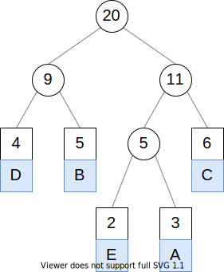

# Huffman Encoder

## Introduction

Huffman coding is an algorithm used for text compression. In a nutshell, the algorithm performs compression by storing the least amount of space for the most frequent characters. A good visualization of how the algorithm works can be seen by [Tom Scott's video on text compression](https://www.youtube.com/watch?v=JsTptu56GM8).

<div align="center">
  
  <p>The Huffman tree for the message BCCABBDDAECCBBAEDDCC</p>
</div>

This program uses Huffman coding to show how much data can be saved for a message that the user will input. It may not always be the case that the algorithm will save more space than the original amount since additional information needs to be stored along with the encoded message.

Note: this program was originally written in Python, but I've also implemented it in Java. Their source codes are located in the `python` and `java` repositories respectively.

## Requirements

If using Python:
- Python 3.9

If using Java:
- Java 17

## Getting started

##### Download the repository using Git or download the zip file.
```bash
$ git clone https://github.com/u06/huffman-encoder.git && cd huffman-encoder
```

##### Within the `input` directory, enter some text within `message.txt`.

```bash
$ echo -n 'BCCABBDDAECCBBAEDDCC' > message.txt
```

##### If using Python, from the repository's root, run `python/main.py` specifying `message.txt`'s path as a command line argument.

```bash
$ python3 python/main.py input/message.txt
```

##### Within the `output` directory, there will be a `results.txt` file that contains the results of Huffman coding used on `message.txt`'s contents.

```
ASCII
---
message: BCCABBDDAECCBBAEDDCC
message (binary): 0100001001000011010000110100000101000010010000100100010001000100010000010100010101000011010000110100001001000010010000010100010101000100010001000100001101000011
bit size: 160

Huffman coding
---
message (binary): 011111101010100001011001111010110110000001111
bit size: 45
table size: 52
total size: 97

result: 60.62% compression
```

##### If using Java, then you can use IntelliJ and run `Main.java`. The output file would look a little different compared to what the Python code outputs.
```
Message: BCCABBDDAECCBBAEDDCC
Binary message: 0100001001000011010000110100000101000010010000100100010001000100010000010100010101000011010000110100001001000010010000010100010101000100010001000100001101000011
Number of bits in binary message: 160

Compressed binary message: 101111011101000000110101111101001101000001111
Number of bits in compressed binary message: 45
Bit size of Huffman encoding table: 52

Total number of bits after compression: 97

Compressed message is 39% smaller
```
